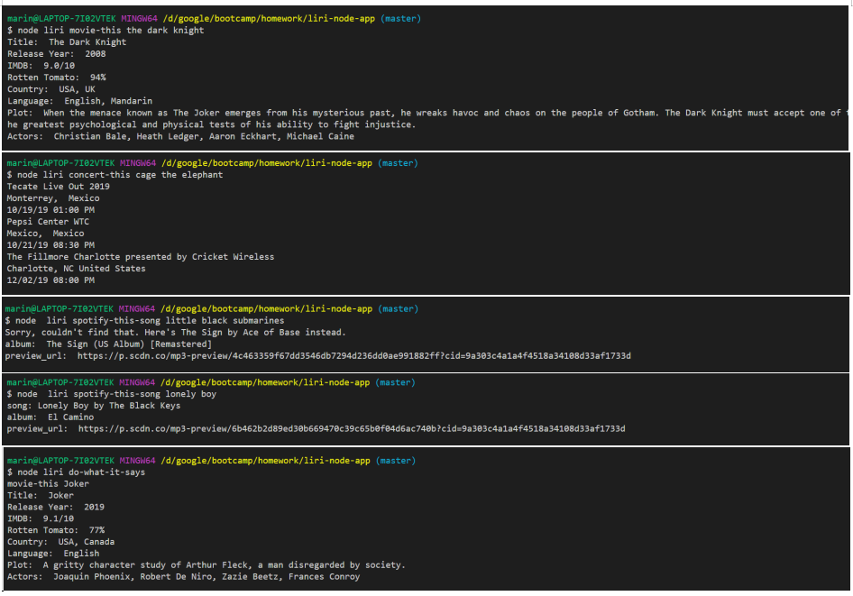

# liri-node-app

<!-- 1. Clearly state the problem the app is trying to solve (i.e. what is it doing and why)
1. Give a high-level overview of how the app is organized
2. Give start-to-finish instructions on how to run the app
3. Include screenshots, gifs or videos of the app functioning -->

;

## Technology
* node.js
  * fs
  * util
  * logFile
  * logStdout
  * npm
    * axios
    * dotenv
    * keys
* API
  * spotify
  * omdb
  * bands in town
  * moment
